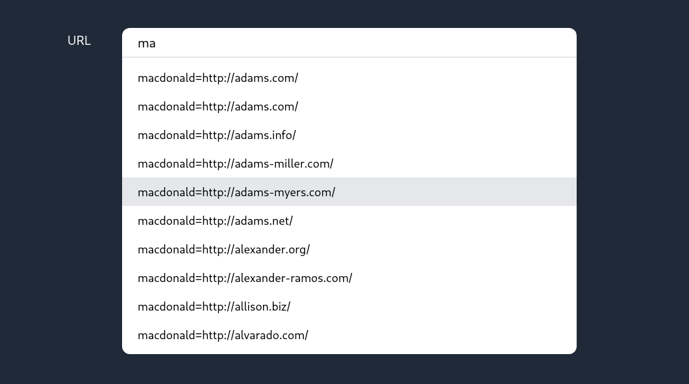
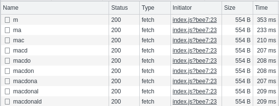
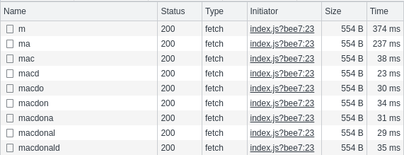
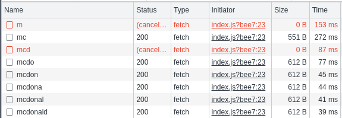

# Autocomplete with PostgreSQL

Demo showcasing autocompletion for a input field with random generated data which is stored persistent in a database.

The suggestions are based on a substring search. The necessary query is done efficiently with a trigram index (pg_trgm, gin).

## Comparison of request times

The randomly generated data consists of 4.5M rows which are stored in a PostgreSQL database.

without index:

with index (pg_trgm, gin):

## Features

Requests are canceled (client-side) if the user types faster than the previous request took to finish.

